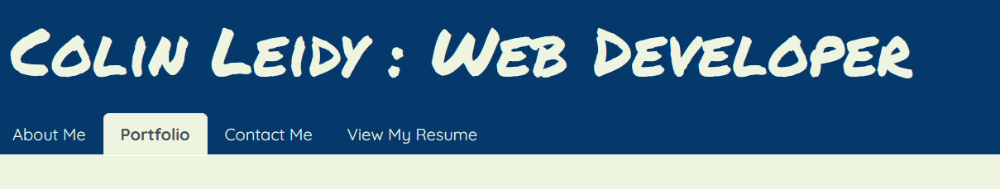
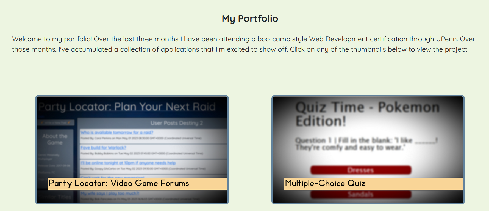

# react-portfolio

### PLEASE NOTE: When deploying, I had an issue with my repo that cause much of my work to be deleted. I had to create a new repo for deploying my work. So while my final repo that is deployed is found [here](https://github.com/CollyLee/react-developer-portfolio), my original repo that contains all of my commits can be found [here](https://github.com/CollyLee/react-portfolio).

## Description

My [React Portfolio](https://github.com/CollyLee/react-portfolio) is a multi-page portfolio that contains details for friends, family, or prospective employers. It uses React in order to render multiple pages within one site, allowing users to toggle between pages without having to completely re-render the page. The site gives users contact information, a quick blurb about me, and the opportunity to contact me with questions or feedback.

## Usage

You can toggle between the different tabs at the top to move from section to section.

You can click on the thumbnails in the portfolio page to view some of my past projects.

The form to Contact Me does not yet work, so in the meantime you can reach out to me at the email address found on the Contact Me page.

My resume can also be downloaded from the View My Resume tab by clicking on the link provided.